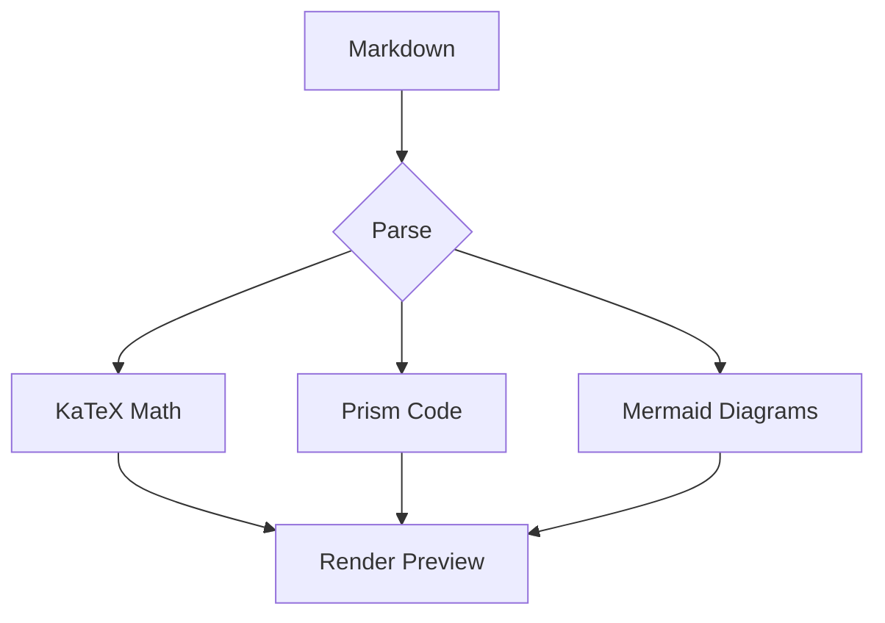

<div align=center>


# Welcome to renderMarkdown

 Suckless Web Utils. No build steps. No dependencies. No subscriptions. A lightweight toolkit for the web, built to replace bloated "SaaS" platforms with simple, local-first alternatives. 

</div>


## Features

- Live preview
- Syntax highlighting for code
- KaTeX math support: $E = mc^2$
- Block math: $$  \int_{-\infty}^{\infty} e^{-x^2} dx = \sqrt{\pi} $$
- Theme switching (night/day)


### Code Example

```zig
const std = @import("std");

pub fn main() !void {
    const stdout = std.io.getStdOut().writer();
    try stdout.print("Hello, {s}!\n", .{"World"});
}

```

### Blockquote

> "The best way to predict the future is to create it."
> — Peter Drucker

### Mermaid Diagram



### Table

| Feature | Status |
|---------|--------|
| Markdown | ✅ |
| Mermaid | ✅ |
| Math | ✅ |
| Theme | ✅ |

---

*Enjoy writing!*


